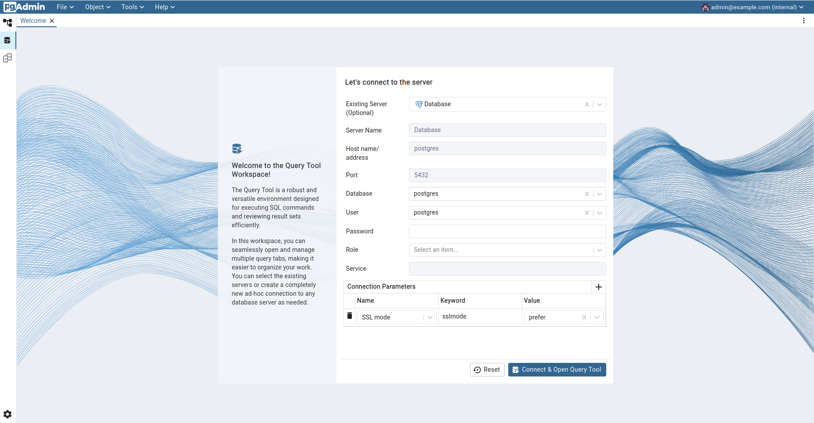

# dbms-postgres-251

## Run command
```
docker compose up -d
```

## Access the container and use database `bikedb`
```
 docker exec -it pg_container psql -U postgres -d bikedb
```

### Import data into PostgreSQL container
In CLI: Run queries in file `0.create_table.sql` (located in `scripts/sql/`)

### Query data and functionality testing
- Go to your browser, paste the URL `localhost:8082` to access the `pgadmin` - a UI for easy monitoring and testing Postgre database system properties.
- Testing queries are located in folder `scripts/sql`, with each file represents a functionality in Postgre DBS.

- You can connect to postgres database with configurations as in the figure below:


## Shutdown command
```
docker compose down -v
<!-- sudo rm -rf data -->
```

## Next step
- Generate fake data for text data (for performance measurement of DBMS) - no impact on root dataset - not done as full dataset not handled as import full

- Identify necessary column (measure criticality) - useless ones - briefly done

- Output as script (reusable) - done

- Identify business requirements - prompt as stakeholders

- Centralize image (if possible) - this item as handled manually to local as large size -> large effort

## ⚙️ Setup & Commands
#### Please notice that download the data image from ref links, extracting it and place it in the folder data beforing naming it as `test_MRI_Data`. Moreover, download the excel report file and add it under data folder.
### 1. Start PostgreSQL + pgAdmin
```bash
make up
```

➡ Spins up the containers from `docker-compose.yml`.
pgAdmin is available at `http://localhost:8082` (login with the credentials in your docker-compose file).

---

### 2. Initialize Database Schema

```bash
make init-db
```

➡ Runs `scripts/sql/init_schema.sql` inside the container and sets up the following tables:

* `patients`
* `reports`
* `spine_levels`
* `findings`
* `extra_findings`
* `dicom_metadata`

---

### 3. Load Excel Reports (Clinician Notes)

```bash
make setup-etl
make etl-report
```

➡ Runs `scripts/etl/import_reports.py` locally.

* Reads `Radiologists Report.xlsx`
* Inserts into **patients** + **reports**
* Splits findings into `spine_levels` and `findings`

---

### 4. Load MRI Metadata (DICOM)

```bash
make etl-mri
```

➡ Runs `scripts/etl/import_mri_data.py` locally.

* Walks through `./data/test_MRI_Data`
* Extracts DICOM metadata (sex, age, modality, slice thickness, etc.)
* Inserts into **dicom\_metadata**

---

### 5. Clear All MRI Data (reset for testing)

```bash
make clear-mri
```

➡ Keeps schema but removes all MRI rows.
Use when re-importing DICOM datasets.

---

### After run above commands, you can see the tables imported by executing the query below in the UI:

```
SELECT schemaname, tablename
FROM pg_tables
WHERE schemaname = 'public';
```


### 6. Open SQL Shell

```bash
make psql
```

➡ Opens `psql` CLI inside container for manual queries.

---

## 📊 Schema Overview

### **patients**

Stores unique patient identifiers.

```sql
SELECT * FROM patients LIMIT 5;
```

---

### **reports**

Stores text reports (raw + cleaned).

```sql
SELECT report_id, LEFT(raw_text, 80)
FROM reports
LIMIT 5;
```

---

### **spine\_levels**

Structured extraction of vertebral levels from notes.

```sql
SELECT * FROM spine_levels WHERE region = 'L';
```

---

### **findings**

Structured findings tied to spine levels.

```sql
SELECT finding_type, COUNT(*) 
FROM findings 
GROUP BY finding_type;
```

---

### **extra\_findings**

Incidental notes not tied to specific levels.

```sql
SELECT * FROM extra_findings WHERE report_id = 1;
```

---

### **dicom\_metadata**

MRI image metadata (linked by patient\_id).

```sql
SELECT patient_id, COUNT(*) AS image_count
FROM dicom_metadata
GROUP BY patient_id;
```

---

## 🔍 Typical Queries

* **All MRI images for a patient**

```sql
SELECT file_path, series_description
FROM dicom_metadata
WHERE patient_id = 3;
```

* **Reports + findings for a patient**

```sql
SELECT r.report_id, f.finding_type, f.severity
FROM reports r
JOIN spine_levels s ON r.report_id = s.report_id
JOIN findings f ON s.level_id = f.level_id
WHERE r.patient_id = 3;
```

* **All images related to a finding (e.g., “bulge”)**

```sql
SELECT f.finding_type, d.file_path
FROM findings f
JOIN spine_levels s ON f.level_id = s.level_id
JOIN reports r ON s.report_id = r.report_id
JOIN dicom_metadata d ON r.patient_id = d.patient_id
WHERE f.finding_type = 'bulge';
```

